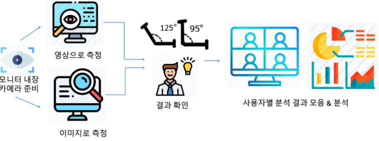
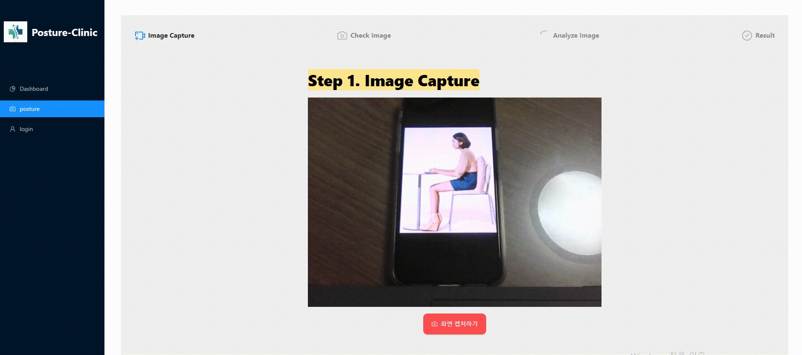

# **Welcome to Posture-Clinic👩‍💻**

### AI 기반 모션인식을 통한 자세교정 솔루션 **Posture-Clinic** 입니다

# **Background & Concept**


COVID-19의 발발로 **Untact**는 폭발적으로 증가하고 외부 활동과 움직임은 최소화됐습니다. 사용자의 앉은 자세를 측정하여 자세 개선 솔루션을 제공합니다.

📌Problem 01. 비대면 교육 환경

☑️ 청소년기는 평생의 자세가 형성되는 중요한 시기입니다. COVID-19로 인한 온라인 교육 환경은 청소년들에게 척추측만증을 안겨줄 수 있습니다.

📌Problem 02. 움직임 감소로 인한 건강 적신호

☑️ 외부활동을 자제하고 집에서 지내는 시간이 늘어나면서 미디어를 보는 시간이 늘어났고, 움직임임은 현저히 줄어들었습니다. 

📌Problem 03. 생활 습관 개선의 필요성

☑️ 올바르지 않은 자세로 생활하다보면 몸이 그대로 굳어 건강에 이상이 생깁니다. 우리는 바른 자세를 유지함으로써 관리를 해야 합니다. 

# **Product Detail**



# **How to start**

1. Clone

   ```bash
   git clone https://github.com/POSCOict-Internship-TeamB/Posture_Clinic.git
   ```

2. Creat .env file in server folder

   ```bash
   MONGO_URI = 'mongodb+srv://ID:PW@poscoict-internship-tea.pjwph.mongodb.net/test?authSource=admin&replicaSet=atlas-x4q3t7-shard-0&readPreference=primary&appname=MongoDB%20Compass&ssl=true'

   ```

3. VS Code 터미널에 입력
   `docker-compose up --build`
   Then, you can access to your server http://localhost:3000

# **Technology stack**

### Architecture


### Tech Stack

- Front-end

    
     
    
    
    

- Back-end

    
    
    

- Server

    
    

- ETC

    
    

# **Demo**

## **Image**



## **Video**


### Directory

- client

```bash
 |-Dockerfile
  |-jsconfig.json
  |-package-lock.json
  |-package.json
  |-public
  |  |-architecture.png
  |  |-favicon.ico
  |  |-index.html
  |  |-mainlogo.png
  |  |-manifest.json
  |  |-neck.png
  |  |-posture.png
  |  |-sit.png
  |-setupProxy.js
  |-src
  |  |-App.js
  |  |-components
  |  |  |-BaseComponents.js
  |  |  |-Layout
  |  |  |  |-FooterLayout.js
  |  |  |  |-SiderLayout.js
  |  |-Config.js
  |  |-index.css
  |  |-index.js
  |  |-lib
  |  |  |-styles
  |  |  |  |-index.js
  |  |  |  |-stylesheet
  |  |  |  |  |-alignChild.js
  |  |  |  |  |-alignSelf.js
  |  |  |  |  |-index.js
  |  |  |  |  |-mediaQuery.js
  |  |  |  |  |-pad.js
  |  |  |  |  |-round.js
  |  |  |  |  |-size.js
  |  |  |  |  |-spacing.js
  |  |  |  |  |-typo.js
  |  |  |  |-values.js
  |  |-pages
  |  |  |-Dashboard
  |  |  |  |-Dashboard.js
  |  |  |  |-ResultModal.js
  |  |  |-Login
  |  |  |  |-Login.js
  |  |  |-Posture
  |  |  |  |-index.js
  |  |  |  |-MeasureImage.js
  |  |  |  |-MeasureVideo.js
  |  |-serviceWorker.js
```

- server

```bash
  |-.env
  |-.gitignore
  |-Dockerfile
  |-image.py
  |-measure.py
  |-pose_deploy_linevec.prototxt
  |-pose_iter_160000.caffemodel
  |-requirements.txt
  |-server.py
  |-uploads
  |  |-cv2_image.png
  |  |-Landmark_Datas.csv
  |  |-posture.png
```

# **Team members**

- 박현우 (https://github.com/parkhj0423)
- 이가은 (https://github.com/Lee-Ga-eun)
- 김병근 (https://github.com/kimbyeonggeun)
- 이미영 (https://github.com/MiMi012)
- 신재관 (https://github.com/Jaegwan-Shin)
