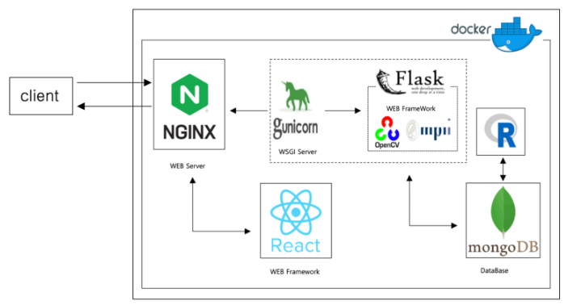

# **Preview**


# **How to start**

1. Clone
    ```
    git clone https://github.com/POSCOict-Internship-TeamB/Posture_Clinic.git
    ```

2. Creat .env file in server folder
    ```
    MONGO_URI = 'mongodb+srv://ID:PW@poscoict-internship-tea.pjwph.mongodb.net/test?authSource=admin&replicaSet=atlas-x4q3t7-shard-0&readPreference=primary&appname=MongoDB%20Compass&ssl=true'
    
    ```
    

3. VS Code 터미널에 입력
    ```
    docker-compose up --build
    ```
Then, you can access to your server http://localhost:3000

# **Technology stack**

### Architecture



### Tech Stack

- Front-end

    
     
    
    
    

- Back-end

    
    
    

- Server

    
    

- ETC

    
    


# **Team members**
- 박현우 (https://github.com/parkhj0423)
- 이가은 (https://github.com/Lee-Ga-eun)
- 김병근 (https://github.com/kimbyeonggeun)
- 이미영 (https://github.com/MiMi012)
- 신재관 (https://github.com/Jaegwan-Shin)